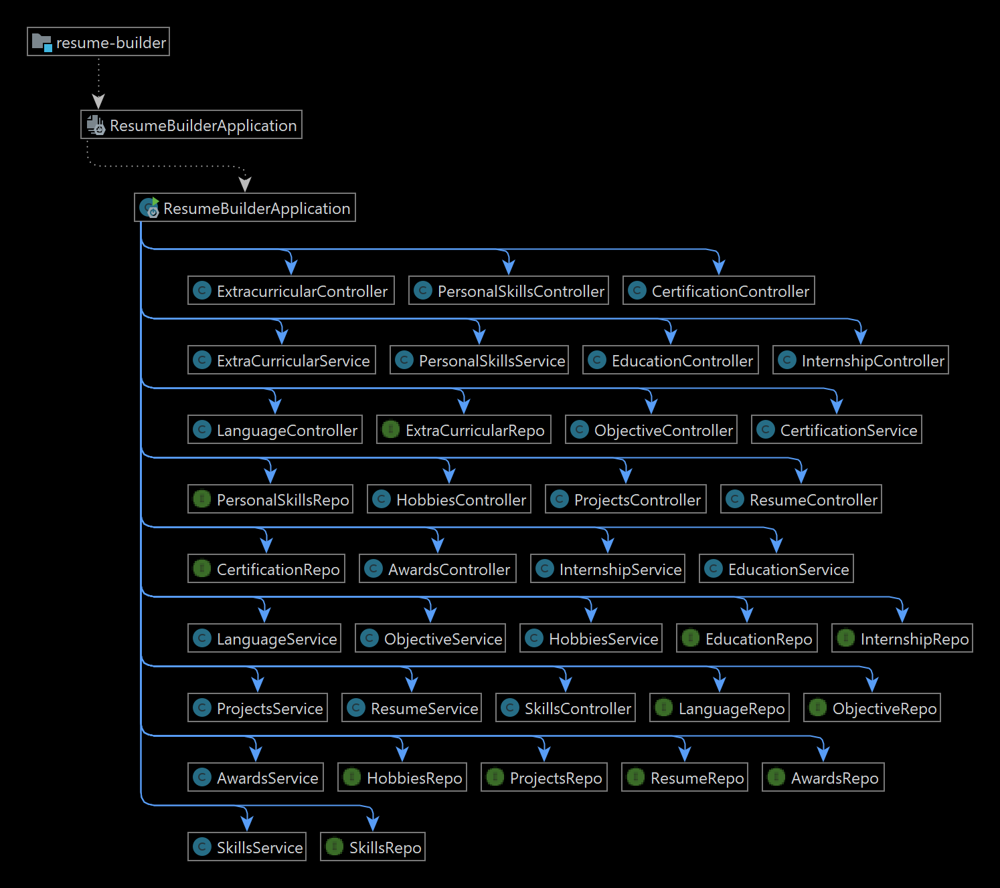
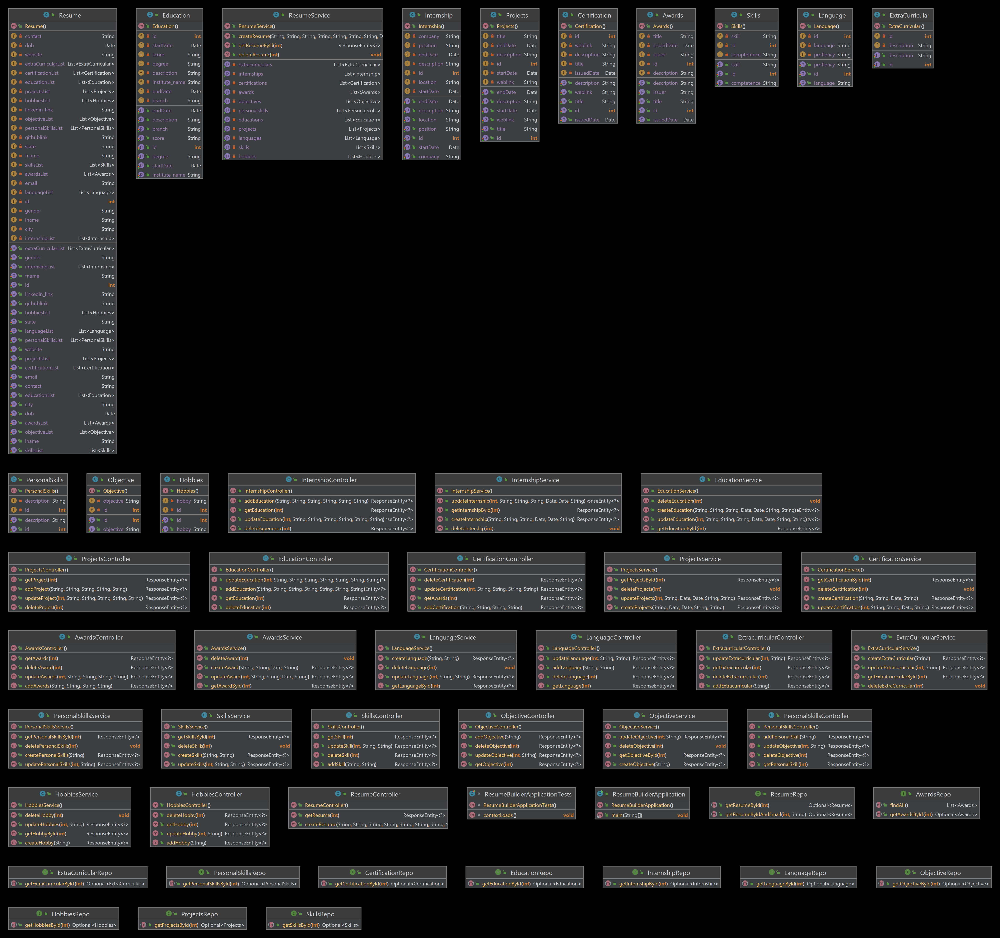

## This project is made under the internship program arranged by CodeClause
# Resume-Builder-Application
# Author: Dinesh Haribhau Dixit

Flowchart:
  

Classes:
  

##### All endpoints are working and have checked with postman client. If you find any bug please contact me.
### Also you can add security, make some fields optional its up to you. 

### Tools used:
IDE:IntelliJ Idea                                                                 
Technologies: Springboot-2.7.11 ,  Java-8, Data-Jpa, MySql                                                             
Client: Postman

### contact
Portfolio: http://mechatron.epizy.com

Linkedin: https://www.linkedin.com/in/dinesh-dixit

Github: https://github.com/Mechatron00
